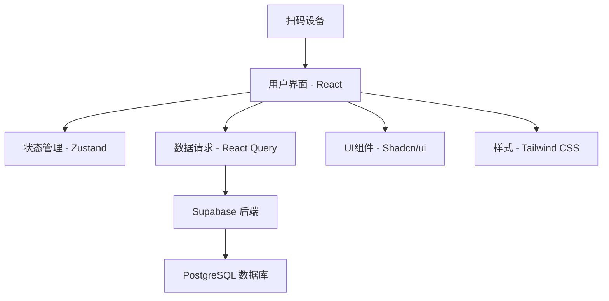

# 设计文档

## 概述

药品出入库管理软件采用现代化的全栈架构，前端使用 React + Vite 构建，后端使用 Supabase 提供数据存储和认证服务。系统设计遵循组件化、模块化原则，确保代码可维护性和扩展性。

## 架构

### 整体架构



### 技术栈

- **前端框架**: React 18+ with TypeScript
- **构建工具**: Vite
- **状态管理**: Zustand
- **路由**: React Router v6
- **数据请求**: React Query (TanStack Query)
- **UI框架**: Shadcn/ui + Tailwind CSS
- **表单处理**: React Hook Form + Zod validation
- **后端服务**: Supabase (数据库 + 认证 + 实时订阅)
- **部署**: Vercel (前端)

## 组件和接口

### 核心组件结构

```
src/
├── components/
│   ├── ui/                 # Shadcn/ui 基础组件
│   ├── layout/            # 布局组件
│   ├── scanner/           # 扫码相关组件
│   ├── inventory/         # 库存管理组件
│   ├── reports/           # 报表组件
│   └── auth/              # 认证组件
├── pages/                 # 页面组件
├── hooks/                 # 自定义 hooks
├── stores/                # Zustand 状态管理
├── services/              # API 服务层
├── types/                 # TypeScript 类型定义
└── utils/                 # 工具函数
```

### 主要页面组件

1. **登录页面 (LoginPage)**
   - 用户认证表单
   - 角色验证

2. **仪表板 (Dashboard)**
   - 库存概览
   - 近效期提醒
   - 库存不足提醒

3. **入库管理 (InboundPage)**
   - 扫码入库界面
   - 药品信息录入表单
   - 货架位置管理

4. **出库管理 (OutboundPage)**
   - 扫码出库界面
   - 批次选择
   - 数量确认

5. **库存查询 (InventoryPage)**
   - 药品列表
   - 批次详情
   - 库存统计

6. **报表中心 (ReportsPage)**
   - 消耗统计
   - 数据导出

### 状态管理设计

使用 Zustand 管理全局状态，遵循最佳实践：

```typescript
// 认证状态 - 使用 create 函数创建 store
interface AuthState {
  user: User | null;
  isAuthenticated: boolean;
}

interface AuthActions {
  login: (credentials: LoginCredentials) => Promise<void>;
  logout: () => void;
  setUser: (user: User | null) => void;
}

export const useAuthStore = create<AuthState & AuthActions>((set, get) => ({
  user: null,
  isAuthenticated: false,
  
  login: async (credentials) => {
    try {
      const { data, error } = await supabase.auth.signInWithPassword(credentials);
      if (error) throw error;
      set({ user: data.user, isAuthenticated: true });
    } catch (error) {
      throw error;
    }
  },
  
  logout: async () => {
    await supabase.auth.signOut();
    set({ user: null, isAuthenticated: false });
  },
  
  setUser: (user) => set({ user, isAuthenticated: !!user }),
}));

// 库存扫码状态
interface ScanState {
  currentScan: ScannedItem | null;
  isScanning: boolean;
}

interface ScanActions {
  setScanResult: (item: ScannedItem) => void;
  clearScan: () => void;
  setScanning: (isScanning: boolean) => void;
}

export const useScanStore = create<ScanState & ScanActions>((set) => ({
  currentScan: null,
  isScanning: false,
  
  setScanResult: (item) => set({ currentScan: item, isScanning: false }),
  clearScan: () => set({ currentScan: null }),
  setScanning: (isScanning) => set({ isScanning }),
}));

// 通知状态
interface NotificationState {
  notifications: Notification[];
}

interface NotificationActions {
  addNotification: (notification: Omit<Notification, 'id'>) => void;
  removeNotification: (id: string) => void;
  clearNotifications: () => void;
}

export const useNotificationStore = create<NotificationState & NotificationActions>((set) => ({
  notifications: [],
  
  addNotification: (notification) => set((state) => ({
    notifications: [...state.notifications, { ...notification, id: crypto.randomUUID() }]
  })),
  
  removeNotification: (id) => set((state) => ({
    notifications: state.notifications.filter(n => n.id !== id)
  })),
  
  clearNotifications: () => set({ notifications: [] }),
}));

// 使用 useShallow 优化性能的选择器示例
import { useShallow } from 'zustand/react/shallow';

// 在组件中使用
const { user, isAuthenticated } = useAuthStore(
  useShallow((state) => ({ 
    user: state.user, 
    isAuthenticated: state.isAuthenticated 
  }))
);
```

## 数据模型

### Supabase 数据库表结构

#### 用户表 (users)
```sql
CREATE TABLE users (
  id UUID PRIMARY KEY DEFAULT gen_random_uuid(),
  email VARCHAR UNIQUE NOT NULL,
  name VARCHAR NOT NULL,
  role VARCHAR NOT NULL CHECK (role IN ('admin', 'manager', 'operator')),
  created_at TIMESTAMP DEFAULT NOW(),
  updated_at TIMESTAMP DEFAULT NOW()
);
```

#### 药品表 (medicines)
```sql
CREATE TABLE medicines (
  id UUID PRIMARY KEY DEFAULT gen_random_uuid(),
  barcode VARCHAR UNIQUE NOT NULL,
  name VARCHAR NOT NULL,
  specification VARCHAR,
  manufacturer VARCHAR,
  shelf_location VARCHAR,
  safety_stock INTEGER DEFAULT 0,
  created_at TIMESTAMP DEFAULT NOW(),
  updated_at TIMESTAMP DEFAULT NOW()
);
```

#### 批次表 (batches)
```sql
CREATE TABLE batches (
  id UUID PRIMARY KEY DEFAULT gen_random_uuid(),
  medicine_id UUID REFERENCES medicines(id),
  batch_number VARCHAR NOT NULL,
  production_date DATE NOT NULL,
  expiry_date DATE NOT NULL,
  quantity INTEGER NOT NULL DEFAULT 0,
  created_at TIMESTAMP DEFAULT NOW(),
  updated_at TIMESTAMP DEFAULT NOW()
);
```

#### 库存记录表 (inventory_transactions)
```sql
CREATE TABLE inventory_transactions (
  id UUID PRIMARY KEY DEFAULT gen_random_uuid(),
  medicine_id UUID REFERENCES medicines(id),
  batch_id UUID REFERENCES batches(id),
  user_id UUID REFERENCES users(id),
  type VARCHAR NOT NULL CHECK (type IN ('inbound', 'outbound')),
  quantity INTEGER NOT NULL,
  remaining_quantity INTEGER NOT NULL,
  notes TEXT,
  created_at TIMESTAMP DEFAULT NOW()
);
```

### TypeScript 类型定义

```typescript
interface Medicine {
  id: string;
  barcode: string;
  name: string;
  specification?: string;
  manufacturer?: string;
  shelfLocation?: string;
  safetyStock: number;
  createdAt: string;
  updatedAt: string;
}

interface Batch {
  id: string;
  medicineId: string;
  batchNumber: string;
  productionDate: string;
  expiryDate: string;
  quantity: number;
  medicine?: Medicine;
}

interface InventoryTransaction {
  id: string;
  medicineId: string;
  batchId: string;
  userId: string;
  type: 'inbound' | 'outbound';
  quantity: number;
  remainingQuantity: number;
  notes?: string;
  createdAt: string;
  medicine?: Medicine;
  batch?: Batch;
  user?: User;
}
```

## 错误处理

### 前端错误处理策略

1. **网络错误处理**
   - React Query 自动重试机制
   - 离线状态检测
   - 错误边界组件

2. **表单验证**
   - Zod schema 验证
   - 实时验证反馈
   - 服务端验证错误显示

3. **扫码错误处理**
   - 无效条码提示
   - 摄像头权限处理
   - 扫码超时处理

### 后端错误处理

1. **Supabase RLS 策略**
   - 行级安全规则
   - 用户权限验证
   - 数据访问控制

2. **数据完整性**
   - 外键约束
   - 检查约束
   - 触发器验证

## 测试策略

### 单元测试
- **工具**: Vitest + Testing Library
- **覆盖范围**: 
  - 工具函数
  - 自定义 hooks
  - 组件逻辑

### 集成测试
- **工具**: Playwright
- **测试场景**:
  - 用户登录流程
  - 扫码入库流程
  - 扫码出库流程
  - 数据导入导出

### 测试数据管理
- 使用 Supabase 测试环境
- 自动化测试数据清理
- Mock 扫码设备响应

## 性能优化

### 前端优化
1. **代码分割**
   - 路由级别懒加载
   - 组件级别动态导入

2. **React Query 缓存策略**
   ```typescript
   // QueryClient 配置
   const queryClient = new QueryClient({
     defaultOptions: {
       queries: {
         staleTime: 5 * 60 * 1000, // 5分钟
         gcTime: 10 * 60 * 1000, // 10分钟
         retry: (failureCount, error) => {
           if (error.status === 404) return false;
           return failureCount < 3;
         },
       },
       mutations: {
         onError: (error) => {
           // 全局错误处理
           useNotificationStore.getState().addNotification({
             type: 'error',
             message: error.message,
           });
         },
       },
     },
   });

   // 预取策略
   const usePrefetchMedicines = () => {
     const queryClient = useQueryClient();
     
     return useCallback(() => {
       queryClient.prefetchQuery({
         queryKey: ['medicines'],
         queryFn: getMedicines,
         staleTime: 10 * 60 * 1000,
       });
     }, [queryClient]);
   };
   ```

3. **Zustand 性能优化**
   ```typescript
   // 使用 useShallow 防止不必要的重渲染
   const { medicines, isLoading } = useMedicineStore(
     useShallow((state) => ({
       medicines: state.medicines,
       isLoading: state.isLoading,
     }))
   );

   // 分离频繁更新的状态
   const useScannerStore = create<ScannerState>((set) => ({
     position: { x: 0, y: 0 },
     isActive: false,
     // 使用 subscribe 进行瞬态更新，避免组件重渲染
   }));
   ```

4. **包体积优化**
   - Tree shaking
   - 依赖分析
   - 按需导入 Shadcn/ui 组件

### 数据库优化
1. **索引策略**
   - 条码字段索引
   - 复合索引优化

2. **查询优化**
   - 分页查询
   - 预加载关联数据

## 安全考虑

### 认证和授权
- Supabase Auth 集成
- JWT token 管理
- 角色权限控制

### 数据安全
- RLS 行级安全
- 输入验证和清理
- SQL 注入防护

### 前端安全
- XSS 防护
- CSRF 保护
- 敏感信息加密存储

## 部署和监控

### 部署策略
- **前端**: Vercel 自动部署
- **后端**: Supabase 托管服务
- **环境管理**: 开发/测试/生产环境分离

### 监控和日志
- Vercel Analytics
- Supabase 日志监控
- 错误追踪和报告

## 扩展性考虑

### 功能扩展
- 插件化架构设计
- API 版本管理
- 微服务拆分准备

### 数据扩展
- 数据库分片策略
- 读写分离
- 缓存层设计