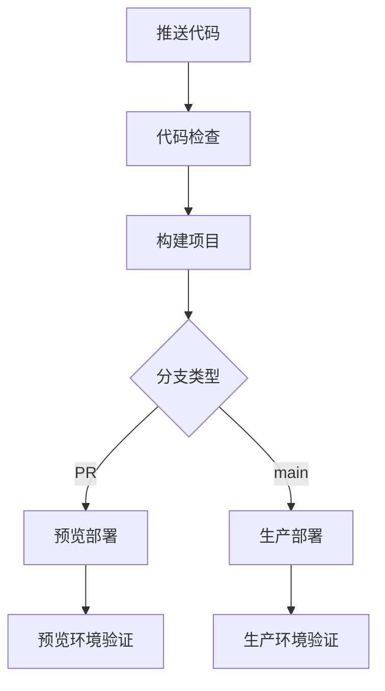

# 完整部署指南

本文档提供了药品出入库管理系统的完整部署流程，基于最新的 Vercel 和 Supabase 最佳实践。

## 目录

- [环境要求](#环境要求)
- [开发环境部署](#开发环境部署)
- [生产环境部署](#生产环境部署)
- [环境变量配置](#环境变量配置)
- [CI/CD 配置](#cicd-配置)
- [部署验证](#部署验证)
- [故障排除](#故障排除)
- [监控和维护](#监控和维护)

## 环境要求

### 必需工具

```bash
# Node.js 18+ (推荐使用 nvm)
curl -o- https://raw.githubusercontent.com/nvm-sh/nvm/v0.39.0/install.sh | bash
nvm install 20
nvm use 20

# Vercel CLI
npm install -g vercel@latest

# Supabase CLI (可选，用于数据库管理)
npm install -g supabase@latest
```

### 账户准备

- **Vercel 账户**: [vercel.com](https://vercel.com)
- **Supabase 项目**: [supabase.com](https://supabase.com)
- **GitHub 仓库**: 确保代码已推送到 GitHub

## 开发环境部署

### 1. 项目初始化

```bash
# 克隆项目
git clone <your-repository-url>
cd pharmacy-inventory-system

# 安装依赖
npm install

# 复制环境变量模板
cp .env.example .env.local
```

### 2. 获取 Supabase 配置

1. 登录 [Supabase Dashboard](https://supabase.com/dashboard)
2. 选择你的项目
3. 进入 Settings → API
4. 复制以下信息：
   - **Project URL**: 用于 `VITE_SUPABASE_URL`
   - **anon public key**: 用于 `VITE_SUPABASE_ANON_KEY`

### 3. 配置环境变量

编辑 `.env.local` 文件：

```env
# 必需配置
VITE_SUPABASE_URL=https://your-project.supabase.co
VITE_SUPABASE_ANON_KEY=your-anon-key
VITE_APP_NAME=药品出入库管理系统
VITE_APP_VERSION=1.0.0
VITE_APP_ENV=development
```

### 4. 验证配置

```bash
# 验证环境变量
npm run validate-env

# 测试 Supabase 连接
npm run test:supabase

# 运行健康检查
npm run health-check
```

### 5. 启动开发服务器

```bash
# 启动开发服务器
npm run dev

# 在浏览器中打开 http://localhost:5173
```

### 6. 创建测试用户

```bash
# 创建测试用户 (需要 SUPABASE_SERVICE_ROLE_KEY)
npm run create:test-users
```

这将创建以下测试账户：

- **管理员**: admin@pharmacy.com (密码: Admin123!)
- **经理**: manager@pharmacy.com (密码: Manager123!)
- **操作员**: operator@pharmacy.com (密码: Operator123!)
- **操作员2**: operator2@pharmacy.com (密码: Operator123!)

### 7. 部署到开发环境

```bash
# 登录 Vercel
vercel login

# 部署到预览环境
vercel

# 或者使用项目脚本
npm run deploy:dev
```

## 生产环境部署

### 1. Vercel 项目设置

#### 1.1 连接 GitHub 仓库

```bash
# 链接 Vercel 项目
vercel link

# 获取项目信息
vercel project ls
```

#### 1.2 获取 Vercel 配置信息

在 Vercel Dashboard 中获取：

- **Organization ID**: Settings → General
- **Project ID**: Project Settings → General

创建 Vercel Token：

```bash
vercel tokens create
```

### 2. 配置环境变量

#### 2.1 在 Vercel Dashboard 中设置

进入项目 → Settings → Environment Variables，添加以下变量：

**生产环境必需变量**：

```
VITE_SUPABASE_URL=https://your-production-project.supabase.co
VITE_SUPABASE_ANON_KEY=your-production-anon-key
VITE_APP_NAME=药品出入库管理系统
VITE_APP_VERSION=1.0.0
VITE_APP_ENV=production
VITE_ENABLE_ANALYTICS=true
VITE_ENABLE_ERROR_REPORTING=true
VITE_ENABLE_HTTPS_ONLY=true
```

**管理脚本变量** (仅开发环境需要)：

```
SUPABASE_SERVICE_ROLE_KEY=your-service-role-key
```

⚠️ **重要**: `SUPABASE_SERVICE_ROLE_KEY` 仅用于开发环境的管理脚本，不要在生产环境中设置此变量

**可选监控变量**：

```
VITE_SENTRY_DSN=your-sentry-dsn
VITE_ANALYTICS_ID=your-analytics-id
```

#### 2.2 使用 Vercel CLI 设置环境变量

```bash
# 设置单个环境变量
vercel env add VITE_SUPABASE_URL production

# 从文件批量设置
vercel env pull .env.production.local
```

### 3. GitHub Secrets 配置

在 GitHub 仓库中设置 Secrets：

- 进入仓库 → Settings → Secrets and variables → Actions
- 添加以下 secrets：

```
VERCEL_TOKEN=your-vercel-token
VERCEL_ORG_ID=your-org-id
VERCEL_PROJECT_ID=your-project-id
```

### 4. 自动部署

推送到 `main` 分支会自动触发生产部署：

```bash
# 提交代码
git add .
git commit -m "feat: 准备生产部署"
git push origin main
```

### 5. 手动部署

如果需要手动部署：

```bash
# 设置环境变量
export VERCEL_ORG_ID=your-org-id
export VERCEL_PROJECT_ID=your-project-id

# 拉取 Vercel 环境信息
vercel pull --yes --environment=production --token=your-token

# 构建生产版本
vercel build --prod --token=your-token

# 部署到生产环境
vercel deploy --prebuilt --prod --token=your-token
```

## 环境变量配置

### 必需变量

| 变量名                   | 描述              | 开发环境示例              | 生产环境示例               |
| ------------------------ | ----------------- | ------------------------- | -------------------------- |
| `VITE_SUPABASE_URL`      | Supabase 项目 URL | `https://dev.supabase.co` | `https://prod.supabase.co` |
| `VITE_SUPABASE_ANON_KEY` | Supabase 匿名密钥 | `eyJ...dev`               | `eyJ...prod`               |
| `VITE_APP_NAME`          | 应用名称          | `药品管理系统(开发)`      | `药品出入库管理系统`       |
| `VITE_APP_VERSION`       | 应用版本          | `1.0.0-dev`               | `1.0.0`                    |
| `VITE_APP_ENV`           | 环境标识          | `development`             | `production`               |

### 环境特定变量

#### 开发环境

```env
VITE_DEV_MODE=true
VITE_ENABLE_DEBUG=true
VITE_ENABLE_MOCK=true
VITE_ENABLE_DEVTOOLS=true
VITE_API_BASE_URL=http://localhost:3000
```

#### 生产环境

```env
VITE_DEV_MODE=false
VITE_ENABLE_DEBUG=false
VITE_ENABLE_MOCK=false
VITE_ENABLE_DEVTOOLS=false
VITE_ENABLE_ANALYTICS=true
VITE_ENABLE_ERROR_REPORTING=true
VITE_ENABLE_HTTPS_ONLY=true
```

### 业务配置变量

```env
# 扫码配置
VITE_SCANNER_TIMEOUT=30000
VITE_SCANNER_RETRY_COUNT=3

# 提醒配置
VITE_EXPIRY_WARNING_DAYS=30
VITE_LOW_STOCK_THRESHOLD=10

# API 配置
VITE_API_TIMEOUT=30000
VITE_API_RETRY_COUNT=3

# 缓存配置
VITE_CACHE_DURATION=300000
```

### 监控配置变量

```env
# 错误监控 (Sentry)
VITE_SENTRY_DSN=https://your-sentry-dsn@sentry.io/project-id

# 分析工具
VITE_ANALYTICS_ID=your-analytics-id

# 性能监控
VITE_ENABLE_PERFORMANCE_MONITORING=true
```

## CI/CD 配置

### GitHub Actions 工作流

项目已配置自动化 CI/CD 流程：

1. **代码检查**: ESLint、TypeScript、格式化检查
2. **构建**: 构建项目并上传构建产物
3. **预览部署**: PR 时自动部署预览版本
4. **生产部署**: 推送到 main 分支时自动部署生产版本

### 部署流程



### 手动触发部署

```bash
# 触发预览部署
git checkout -b feature/new-feature
git push origin feature/new-feature
# 创建 PR 会自动触发预览部署

# 触发生产部署
git checkout main
git merge feature/new-feature
git push origin main
# 推送到 main 会自动触发生产部署
```

## 部署验证

### 自动化验证

```bash
# 运行完整测试套件
npm run test:ci

# 性能检查
npm run performance:analyze

# 安全检查
npm run security:check

# 健康检查
npm run health-check
```

### 手动验证清单

#### 功能验证

- [ ] 网站可以正常访问
- [ ] 用户登录功能正常
- [ ] 扫码功能正常工作
- [ ] 数据库连接正常
- [ ] API 调用正常响应
- [ ] 页面加载速度正常

#### 安全验证

- [ ] HTTPS 证书有效
- [ ] CSP 策略生效
- [ ] 敏感信息未泄露
- [ ] 权限控制正常

#### 性能验证

- [ ] 首屏加载时间 < 2s
- [ ] 交互响应时间 < 100ms
- [ ] 资源缓存正常
- [ ] 图片优化生效

### 性能测试

```bash
# 使用 Lighthouse 检查性能
npx lighthouse https://your-domain.vercel.app --output=html

# 检查构建产物大小
npm run analyze

# 性能监控
npm run performance:monitor
```

## 故障排除

### 常见问题

#### 1. 构建失败

**症状**: GitHub Actions 构建失败

```bash
# 本地检查
npm run type-check
npm run lint
npm run build
```

**解决方案**:

- 修复 TypeScript 类型错误
- 修复 ESLint 警告
- 检查环境变量配置

#### 2. 环境变量未生效

**症状**: 应用无法连接到 Supabase

```bash
# 验证环境变量
npm run validate-env

# 检查 Vercel 环境变量
vercel env ls
```

**解决方案**:

- 检查变量名拼写
- 确认变量值正确
- 重新部署应用

#### 3. Supabase 连接失败

**症状**: 数据库操作失败

```bash
# 测试连接
npm run test:supabase
```

**解决方案**:

- 检查 Supabase URL 格式
- 验证 API 密钥有效性
- 检查网络连接

#### 4. 部署失败

**症状**: Vercel 部署错误

**解决步骤**:

1. 检查构建日志
2. 验证环境变量
3. 检查依赖版本
4. 清理缓存重新部署

```bash
# 查看部署日志
vercel logs

# 清理缓存
vercel --prod --force

# 回滚部署
vercel rollback
```

### 调试工具

```bash
# 检查构建产物
npm run build && ls -la dist/

# 测试本地预览
npm run preview

# 检查依赖
npm audit

# 清理缓存
npm run clean
```

### 回滚策略

#### 1. 代码回滚

```bash
git revert <commit-hash>
git push origin main
```

#### 2. Vercel 回滚

- 在 Vercel 控制台选择之前的部署
- 点击 "Promote to Production"

#### 3. 数据库回滚

```bash
# 使用 Supabase CLI
supabase db reset

# 或运行回滚脚本
npm run db:rollback
```

## 监控和维护

### 设置监控

#### 1. Sentry 错误监控

```bash
# 安装 Sentry
npm install @sentry/vite-plugin @sentry/react

# 配置环境变量
VITE_SENTRY_DSN=your-sentry-dsn
```

#### 2. Vercel Analytics

在 Vercel Dashboard 中启用 Analytics：

- 进入项目设置
- 启用 Analytics
- 配置自定义事件

#### 3. 性能监控

```bash
# 启用性能监控
VITE_ENABLE_PERFORMANCE_MONITORING=true

# 配置性能阈值
VITE_PERFORMANCE_BUDGET_JS=250000
VITE_PERFORMANCE_BUDGET_CSS=50000
```

### 定期维护

#### 每周任务

```bash
# 健康检查
npm run health-check

# 安全扫描
npm audit

# 性能检查
npm run performance:check
```

#### 每月任务

```bash
# 更新依赖
npm update

# 清理缓存
npm run clean

# 备份数据
npm run backup:data
```

#### 每季度任务

```bash
# 性能审查
npm run performance:audit

# 安全审查
npm run security:audit

# 依赖审查
npm run deps:audit
```

### 备份策略

#### 1. 数据库备份

```bash
# 自动备份 (推荐在 Supabase 中配置)
# 手动备份
supabase db dump > backup-$(date +%Y%m%d).sql
```

#### 2. 环境配置备份

```bash
# 导出环境变量
vercel env pull .env.backup

# 备份 Vercel 配置
cp vercel.json vercel.json.backup
```

#### 3. 代码版本控制

- 使用 Git tags 标记重要版本
- 定期创建 release 分支
- 保持 main 分支稳定

### 安全最佳实践

#### 1. 环境变量安全

- 不要在代码中硬编码敏感信息
- 使用 Vercel 环境变量管理
- 定期轮换 API 密钥

#### 2. 网络安全

- 启用 HTTPS
- 配置安全头
- 实施 CSP 策略

#### 3. 访问控制

- 配置适当的 RLS 策略
- 实施用户权限管理
- 定期审查访问日志

## 联系支持

如遇到部署问题，请按以下顺序排查：

1. 查看部署日志
2. 运行健康检查
3. 查阅故障排除指南
4. 搜索相关文档
5. 联系技术团队

**技术支持**:

- 邮箱: tech-support@company.com
- 文档: [内部文档链接]
- 紧急联系: [紧急联系方式]

---

**注意**:

- 请确保在生产环境部署前充分测试所有功能
- 定期备份重要数据和配置
- 遵循安全最佳实践
- 保持依赖项更新
