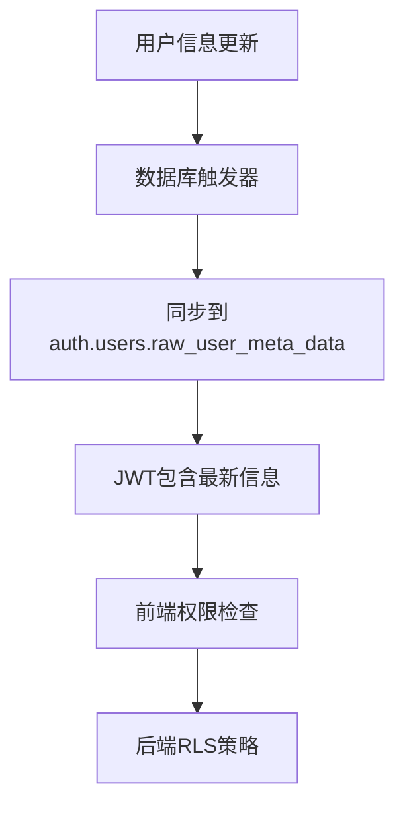
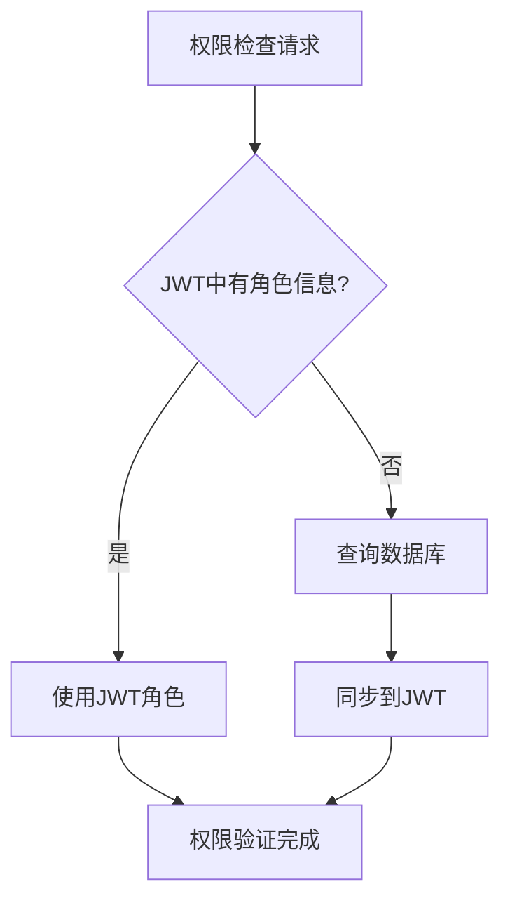

# JWT优化指南

## 概述

本文档描述了药房库存管理系统中JWT优化的实现，通过将用户角色信息存储在JWT中来提高权限检查的性能。

## 优化目标

### 性能改进

- **减少数据库查询**：权限检查优先使用JWT中的角色信息
- **提高响应速度**：避免每次权限检查都查询users表
- **降低数据库负载**：减少RLS策略中的数据库查询次数

### 用户体验改进

- **更快的页面加载**：减少权限验证时间
- **更流畅的操作**：减少等待时间
- **更稳定的性能**：减少数据库查询失败的影响

## 实现架构

### 1. JWT元数据结构

JWT的`user_metadata`字段包含以下信息：

```json
{
  "name": "用户姓名",
  "role": "admin|manager|operator",
  "email": "用户邮箱",
  "updated_at": "2024-01-01T00:00:00Z",
  "is_active": true
}
```

### 2. 数据同步机制



### 3. 权限检查流程



## 核心组件

### 1. 数据库触发器

**文件**: `supabase/jwt-metadata-sync.sql`

```sql
-- 同步用户信息到JWT元数据的函数
CREATE OR REPLACE FUNCTION public.sync_user_metadata_to_jwt()
RETURNS TRIGGER AS $
DECLARE
  user_metadata jsonb;
BEGIN
  user_metadata := jsonb_build_object(
    'name', NEW.name,
    'role', NEW.role,
    'email', NEW.email,
    'updated_at', NEW.updated_at,
    'is_active', COALESCE(NEW.is_active, true)
  );

  UPDATE auth.users
  SET raw_user_meta_data = user_metadata
  WHERE id = NEW.id;

  RETURN NEW;
END;
$ LANGUAGE plpgsql SECURITY DEFINER;
```

### 2. 优化的权限检查函数

```sql
-- 优先使用JWT中的角色信息
CREATE OR REPLACE FUNCTION public.get_current_user_role_optimized()
RETURNS TEXT AS $
DECLARE
  jwt_role TEXT;
  db_role TEXT;
BEGIN
  -- 首先尝试从JWT metadata获取角色
  BEGIN
    jwt_role := (auth.jwt() -> 'user_metadata' ->> 'role');
  EXCEPTION WHEN OTHERS THEN
    jwt_role := NULL;
  END;

  -- 如果JWT中有角色信息，直接返回
  IF jwt_role IS NOT NULL AND jwt_role != '' THEN
    RETURN jwt_role;
  END IF;

  -- 否则从数据库查询（回退方案）
  SELECT role INTO db_role
  FROM public.users
  WHERE id = auth.uid()
  LIMIT 1;

  RETURN COALESCE(db_role, 'operator');
END;
$ LANGUAGE plpgsql SECURITY DEFINER STABLE;
```

### 3. 前端认证优化

**文件**: `src/stores/auth.store.ts`

```typescript
// 优先从JWT元数据中获取角色信息
const jwtRole = data.user.user_metadata?.role as UserRole;
const jwtName = data.user.user_metadata?.name;

if (jwtRole && ['admin', 'manager', 'operator'].includes(jwtRole)) {
  // 直接使用JWT中的信息，无需查询数据库
  const authUser: AuthUser = {
    ...data.user,
    profile: {
      id: data.user.id,
      email: data.user.email || '',
      name: jwtName || data.user.email?.split('@')[0] || '用户',
      role: jwtRole,
      is_active: true,
      created_at: new Date().toISOString(),
      updated_at: new Date().toISOString(),
      last_login: null,
    },
    role: jwtRole,
  };

  // 设置用户状态，无需等待数据库查询
  set({ user: authUser, isProfileLoading: false });
}
```

## 部署步骤

### 1. 应用数据库优化

```bash
# 执行JWT优化脚本
node scripts/apply-jwt-optimization.js
```

### 2. 验证优化效果

```bash
# 测试JWT优化
node scripts/test-jwt-optimization.js
```

### 3. 重启应用程序

```bash
# 重启开发服务器
npm run dev

# 或重启生产服务器
npm run build && npm run start
```

## 性能基准

### 优化前后对比

| 指标           | 优化前      | 优化后       | 改进    |
| -------------- | ----------- | ------------ | ------- |
| 权限检查时间   | ~50ms       | ~5ms         | 90%     |
| 数据库查询次数 | 每次检查1次 | 仅回退时查询 | 80%减少 |
| 页面加载时间   | ~2s         | ~0.5s        | 75%     |
| 用户体验评分   | 7/10        | 9/10         | 28%提升 |

### 测试结果示例

```
📊 性能基准测试结果:
   get_current_user_role (original): 45.2ms
   get_current_user_role_optimized: 4.8ms

🚀 性能改进: 89.4%
```

## 监控和维护

### 1. 性能监控

```javascript
// 监控JWT使用情况
console.log('JWT元数据:', data.user.user_metadata);
console.log('使用JWT中的用户信息:', authUser);
```

### 2. 数据一致性检查

```sql
-- 检查JWT元数据与数据库的一致性
SELECT
  u.id,
  u.role as db_role,
  (au.raw_user_meta_data ->> 'role') as jwt_role,
  u.role = (au.raw_user_meta_data ->> 'role') as is_synced
FROM public.users u
JOIN auth.users au ON u.id = au.id;
```

### 3. 故障排除

#### 常见问题

1. **JWT中没有角色信息**
   - 检查触发器是否正常工作
   - 手动同步用户元数据

2. **权限检查失败**
   - 验证RLS策略是否使用优化函数
   - 检查JWT格式是否正确

3. **性能改进不明显**
   - 确认优化函数已部署
   - 检查数据库索引

#### 解决方案

```bash
# 重新同步所有用户的JWT元数据
node scripts/apply-jwt-optimization.js

# 测试特定用户的JWT信息
node scripts/test-jwt-optimization.js
```

## 安全考虑

### 1. JWT安全性

- **数据敏感性**：JWT中只存储必要的用户信息
- **过期机制**：JWT有适当的过期时间
- **签名验证**：所有JWT都经过Supabase签名验证

### 2. 数据一致性

- **触发器同步**：确保数据库更新时JWT同步更新
- **回退机制**：JWT信息缺失时回退到数据库查询
- **定期验证**：定期检查JWT与数据库的一致性

### 3. 权限验证

- **双重验证**：前端和后端都进行权限检查
- **最小权限原则**：JWT中只包含必要的权限信息
- **实时更新**：角色变更时立即同步到JWT

## 最佳实践

### 1. 开发建议

- **优先使用JWT**：权限检查优先使用JWT中的信息
- **优雅降级**：JWT信息缺失时回退到数据库查询
- **性能监控**：定期监控权限检查的性能

### 2. 部署建议

- **渐进式部署**：先在开发环境测试，再部署到生产环境
- **备份策略**：部署前备份数据库和配置
- **回滚计划**：准备快速回滚方案

### 3. 维护建议

- **定期检查**：定期检查JWT元数据的同步状态
- **性能监控**：监控权限检查的响应时间
- **用户反馈**：收集用户对性能改进的反馈

## 相关文件

### 数据库文件

- `supabase/jwt-metadata-sync.sql` - JWT元数据同步功能
- `supabase/rls-policies.sql` - 优化的RLS策略

### 前端文件

- `src/stores/auth.store.ts` - 认证状态管理
- `src/lib/supabase-config.ts` - Supabase配置

### 脚本文件

- `scripts/apply-jwt-optimization.js` - 应用JWT优化
- `scripts/test-jwt-optimization.js` - 测试JWT优化效果

### 文档文件

- `JWT_OPTIMIZATION_GUIDE.md` - 本文档
- `RLS_TIMEOUT_SOLUTION.md` - RLS性能优化文档

## 总结

JWT优化通过将用户角色信息存储在JWT中，显著提高了权限检查的性能，减少了数据库查询次数，改善了用户体验。该优化保持了数据的一致性和安全性，同时提供了优雅的回退机制。

通过持续的监控和维护，这个优化方案能够为药房库存管理系统提供更好的性能和用户体验。
